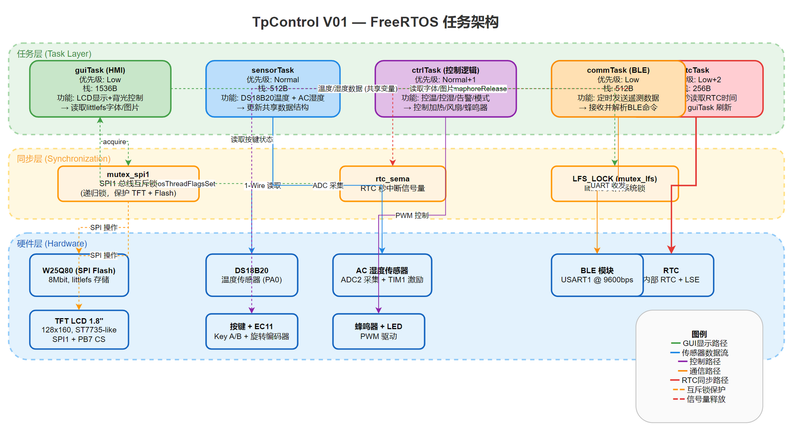

# TpControl V01 — FreeRTOS 任务划分

> 基于 STM32F103C8T6 + FreeRTOS V10.0.1 + CMSIS-RTOS V2

## 硬件资源概况

| 资源 | 规格 |
|------|------|
| MCU | STM32F103C8T6 (Cortex-M3, 72MHz) |
| Flash | 64KB (内部) + 1MB W25Q80 (外部 SPI) |
| RAM | 20KB (内部), FreeRTOS Heap = 5KB |
| 显示器 | TFT LCD 1.8" 128x160 (SPI1, CS=PB7) |
| 温度传感器 | DS18B20 (1-Wire, PA0) |
| 湿度传感器 | AC 电容式 (ADC2 + TIM1 激励) |
| RTC | 内部 RTC (LSE 32.768KHz) |
| 无线 | BLE 模块 (USART1, 9600bps) |
| 输入 | Key A/B + 旋转编码器 EC11 |
| 输出 | 蜂鸣器 (PWM) + LED 指示灯 + 继电器(加热/风扇) |

---

## 总体架构



系统分为 **5 个任务 + 3 层架构**：

```
┌──────────────────────────────────────────────────────────────┐
│                    任务层 (Tasks)                              │
│  rtcTask    sensorTask    ctrlTask    guiTask    commTask     │
└──────────────────────────────┬───────────────────────────────┘
                               │
┌──────────────────────────────┴───────────────────────────────┐
│                  同步层 (Synchronization)                     │
│    mutex_spi1    rtc_sema    LFS_LOCK    task flags          │
└──────────────────────────────┬───────────────────────────────┘
                               │
┌──────────────────────────────┴───────────────────────────────┐
│                   硬件层 (Hardware)                           │
│  W25Q80  TFT  DS18B20  ADC2  RTC  BLE  KEY  BUZZ            │
└──────────────────────────────────────────────────────────────┘
```

---

## 任务详细定义

### 1. guiTask — GUI 显示与 HMI (Human-Machine Interface)

| 属性 | 值 |
|------|------|
| **优先级** | `osPriorityLow` |
| **栈大小** | 1536 字节 |
| **文件** | `myTask.c`, `Gui.c`, `Gui.h` |
| **周期** | 静态画面一次绘制，动态内容每秒刷新 |

**职责：**
- 系统启动时绘制静态 UI 元素（图标、边框、分隔线）
- 每秒响应 RTC 任务通知，更新时间显示
- 从 littlefs 读取字体/图片资源并渲染到 TFT
- 读取共享变量中的温度/湿度/状态，更新数值显示
- LCD 背光控制（常亮/告警闪烁）

**涉及外设：**
- TFT LCD (SPI1, CS=PB7) — 通过 `mutex_spi1` 保护
- W25Q80 Flash (SPI1, CS=PB0) — 通过 littlefs + `mutex_spi1` 读字体/图片

**同步方式：**
- 等待 `rtcTask` 通过 `osThreadFlagsSet` 发送的秒标志
- 通过 `osMutexAcquire(mutex_spi1)` 保护 SPI1 总线访问

---

### 2. sensorTask — 传感器数据采集

| 属性 | 值 |
|------|------|
| **优先级** | `osPriorityNormal` |
| **栈大小** | 512 字节 |
| **文件** | `myTask.c` (当前 humidityACTask + 新增温度读取) |
| **周期** | 温度 ~1s, 湿度 ~2s |

**职责：**
- 定时读取 DS18B20 温度值（1-Wire 协议, PA0）
- AC 湿度传感器采集（ADC2 + TIM1 交流激励）
- 将采集到的温度和湿度写入**共享全局变量**
- 传感器故障检测与状态标记

**涉及外设：**
- DS18B20 (GPIO PA0, 1-Wire) — 独占操作，无需锁
- ADC2 + TIM1 — 湿度采集

**同步方式：**
- 与 `ctrlTask` 通过**共享变量**传递数据（温度值、湿度值、传感器状态）
- 共享变量在写入时可由 `mutex_task` 保护（当前代码中已定义但未使用）

**数据接口：**
```c
// 共享数据结构（建议新增）
typedef struct {
    int16_t temperature;      // 温度值 (x10), -550~1250
    uint16_t humidity;        // 湿度值 (x10), 0~1000
    uint8_t  temp_valid;      // 温度传感器有效标志
    uint8_t  hum_valid;       // 湿度传感器有效标志
    uint32_t last_update;     // 最后更新时间戳 (tick)
} sensor_data_t;

extern volatile sensor_data_t g_sensor;
```

---

### 3. ctrlTask — 控制逻辑与决策

| 属性 | 值 |
|------|------|
| **优先级** | `osPriorityNormal+1`（最高） |
| **栈大小** | 512 字节 |
| **文件** | `myTask.c`（新建） |
| **周期** | 每 500ms~1s 执行一次控制循环 |

**职责：**
- 读取 `sensorTask` 更新的共享传感器数据
- **温度控制**：PID 或 On-Off 算法控制加热继电器
- **湿度控制**：根据湿度偏差控制加湿/风扇
- **告警检测**：超温、低温、传感器故障 → 驱动蜂鸣器
- **模式管理**：小鸡/鸡蛋模式切换，运行天数累计
- **按键/编码器响应**：处理参数调整和菜单导航

**涉及外设：**
- 蜂鸣器 (PWM)
- 加热/风扇继电器 (GPIO)
- LED 指示灯

**同步方式：**
- 读取共享传感器变量（无需阻塞等待，读取瞬时值即可）
- 按键状态通过中断或轮询获取

**控制逻辑概览：**
```
sensorTask  →  g_sensor (共享)  →  ctrlTask
                                       │
                          ┌────────────┼────────────┐
                          ▼            ▼            ▼
                      加热控制     加湿/风扇     告警/蜂鸣器
```

---

### 4. commTask — BLE 通信

| 属性 | 值 |
|------|------|
| **优先级** | `osPriorityLow` |
| **栈大小** | 512 字节 |
| **文件** | `myTask.c`（当前 BLE 功能分散，需整合） |
| **周期** | 遥测发送 ~2s/次，命令接收连续 |

**职责：**
- 定期通过 BLE UART 发送遥测数据：
  - 当前温湿度、设定值、运行模式
  - 告警状态、运行天数
- 接收并解析 BLE 下行命令：
  - 温湿度设定值调整
  - 模式切换
  - 手动控制 (加热/风扇/蜂鸣器)
- 掉线检测与重连

**涉及外设：**
- BLE 模块 (USART1, 9600bps) — 独占 USART1

**同步方式：**
- 读取共享传感器和控制状态变量
- USART1 独占使用（BLE 模块独占）

**数据帧建议：**
```
上行遥测:  AT+TP=<temp>,<hum>,<set_temp>,<mode>,<alarm>\r\n
下行命令:  AT+SET=<param>,<value>\r\n
```

---

### 5. rtcTask — 实时时钟同步

| 属性 | 值 |
|------|------|
| **优先级** | `osPriorityLow+2` |
| **栈大小** | 256 字节 |
| **文件** | `myTask.c`（已有实现） |
| **周期** | 每秒执行一次（RTC 秒中断触发） |

**职责：**
- 等待 `rtc_sema` 信号量（由 RTC 秒中断 `RTC_IRQHandler` 释放）
- 调用 `rtc_get_time()` 更新全局 `calendar` 结构体
- 通过 `osThreadFlagsSet(gui_task_hdl, 1)` 通知 `guiTask` 刷新时间显示
- 闹钟触发处理

**涉及外设：**
- 内部 RTC (LSE 32768Hz)

**同步方式：**
- 通过信号量 `rtc_sema` 与中断同步
- 通过线程标志与 `guiTask` 同步

**当前代码流：**
```
RTC_IRQHandler (中断)
  → osSemaphoreRelease(rtc_sema)

rtcTask
  → osSemaphoreAcquire(rtc_sema, waitForever)
  → rtc_get_time()
  → osThreadFlagsSet(gui_task_hdl, 1)
```

---

## 任务间通信总结

| 数据流向 | 方式 | 方向 | 频率 |
|---------|------|------|------|
| RTC → guiTask | `osThreadFlagsSet` | 单向 | 1Hz |
| RTC → alarm | 中断直接处理 | 单向 | 事件 |
| sensorTask → ctrlTask | 共享变量 `g_sensor` | 单向 | 数据更新时 |
| ctrlTask → guiTask | 共享变量 `g_ctrl_status` | 单向 | 状态变化时 |
| commTask → 读取 | 共享变量 `g_sensor` + `g_ctrl_status` | 只读 | 发送周期 |
| commTask → ctrlTask (命令) | 命令队列 (建议 `osMessageQueue`) | 异步 | 命令到达时 |

---

## 互斥资源与锁

| 资源 | 锁 | 类型 | 被哪些任务使用 |
|------|-----|------|-------------|
| SPI1 总线 | `mutex_spi1` | 递归互斥锁 | guiTask(TFT), guiTask(littlefs) |
| TFT LCD | 由 `mutex_spi1` 隐式保护 | — | guiTask |
| W25Q80 Flash (littlefs) | `mutex_spi1` + LFS_LOCK | 递归互斥锁 | guiTask (读字体/图片) |
| USART1 (BLE) | 独占 (无竞争) | — | commTask |
| DS18B20 | 独占 (无竞争) | — | sensorTask |
| ADC2 | 独占 (无竞争) | — | sensorTask |
| 共享传感器数据 | `mutex_task` (建议) | 互斥锁 | sensorTask写, ctrlTask/commTask读 |

> **重要：** SPI1 总线的 TFT 和 W25Q80 必须使用同一把锁。当前代码中两者分用 `mutex_spi1` 和 `mutex_lfs` 是竞态风险，已由 `doc/littlefs_W25Q80_driver_analysis.md` 详细分析。推荐的修复是让 littlefs 的 `LOCK`/`UNLOCK` 回调也使用 `mutex_spi1`。

---

## 任务栈使用预估

| 任务 | 分配 | 主要栈消耗来源 | 余量 |
|------|------|--------------|------|
| guiTask | 1536B | LCD驱动buffer(1KB)+文件读buf(1.2KB)+函数调用链 | 充足 |
| sensorTask | 512B | 局部变量+DS18B20时序 | 充足 |
| ctrlTask | 512B | 控制计算 | 充足 |
| commTask | 512B | 格式化字符串+协议解析 | 充足 |
| rtcTask | 256B | calendar 结构体(~20B)+时间计算 | 充足 |
| **总计** | **3328B** | — | FreeRTOS Heap 剩余 ~1.7KB |

> FreeRTOS Kernel + TCB 开销：每个任务 TCB 约 80-120 字节，5 个任务共约 400-600 字节。
> 空闲任务 + 定时器服务任务由 FreeRTOS 自动创建。

---

## 与原系统对比

| 项目 | 原系统 (4个任务) | 新划分 (5个任务) | 变化说明 |
|------|-----------------|-----------------|---------|
| guiTask | ✓ (2048B, Low) | ✓ (1536B, Low) | 栈可缩减, 合并背光控制 |
| rtcTask | ✓ (1024B, Low+2) | ✓ (256B, Low+2) | 栈过大, 可大幅缩减 |
| lcdLightTask | ✓ (128B, Low) | **合并到 guiTask** | 仅控制LED闪烁，无需独立任务 |
| humidityACTask | ✓ (128B, Low2) | **升级为 sensorTask** | 扩充为通用传感器采集任务 |
| ctrlTask | ✗ | **新增** (512B, Normal+1) | 温控/湿控/告警逻辑集中管理 |
| commTask | ✗ | **新增** (512B, Low) | BLE 通信集中管理 |
| 总计栈 | 3328B | **3328B** | 功能扩充但总栈持平 |

---

## 后续优化建议

1. **SPI1 总线锁统一**（P0）：将 `mutex_lfs` 合并到 `mutex_spi1`，消除竞态条件
2. **W25Q80 函数缺锁修复**（P0）：为 `W25Q80.c` 中直接调用的函数（如 `w25q80_read_id`）加入 `mutex_spi1` 保护
3. **冗余 wait_busy 消除**（P1）：在 `w25q80_pro_fs()`和 `w25q80_erase_fs()` 中去掉重复的忙等待
4. **spin-lock 改进**（P2）：`w25q80_wait_busy()` 轮询中插入 `osDelay(1)` 让出 CPU
5. **新建 `sensor_data.h`**：明确定义传感器共享数据结构

---

*文档版本: 2026-05-07*
*关联文件: `doc/image/task_architecture.drawio`, `doc/image/task_architecture.png`*
